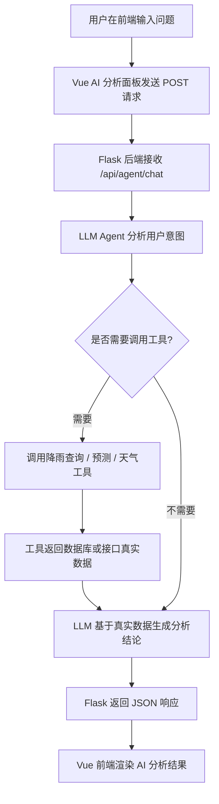

# waterfull_map
基于Echarts中国降雨量可视化平台的设计和实现

# 使用说明

## 后端方面
### 打开pa文件夹执行以下步骤：
执行rain_crawer.py进行数据爬取
执行provinceRain_database.py进行数据库数据整合
分别执行train_all_cities.py和train_all_provinces.py进行本地模型预测分析(LSTM , RF)
打开后端主程序app.py

## 前端方面
    打开Rainfull_map文件夹执行以下步骤
### 在该文件目录下执行
    npm run dev

# llm流程

# 总结
- 基于 **Vue3、ECharts、Flask、MySQL** 构建降雨量智能分析平台，实现地图下钻、历史降雨查询、未来 7 天预测和 AI 问答分析功能。
- 将历史降雨查询、实时天气查询、未来降雨预测等能力封装为 **LangChain Agent Tools**，使大语言模型能够根据用户问题自动选择工具完成数据分析。
- 设计城市 / 省份层级的动态路由逻辑，支持用户查询指定地区或当前地图选中地区的降雨趋势、预测结果和风险分析。
- 集成 **RandomForest 与 LSTM** 预测模型，后端根据地区动态加载模型文件，返回未来降雨量、降雨标记及雨强等级信息。
- 设计 AI 分析面板，实现 **“地图下钻 + 图表展示 + 智能问答”** 的联动式交互体验，提高系统的数据分析可用性。
